# Project 1: Design Journey

Be clear and concise in your writing. Bullets points are encouraged.

**Everything, including images, must be visible in Markdown Preview.** If it's not visible in Markdown Preview, then we won't grade it. We won't give you partial credit either. This is your warning.

## Existing Design, Planning, & Refined Design (Milestone 1)

### Existing Site: Target Audience I (Milestone 1)
> Who is your _existing_ site's target audience?

The existing site's target audience are people in my class or any of the clubs I'm in, who may want to get the chance to know me a little bit better.


### Existing Site: Target Audience I Needs (Milestone 1)
> Document your existing site's target audience's needs.
> List each need below. There is no specific number of needs required for this, but you need enough to do the job.

- Need #1: Basic Facts
  - **Need**
    - > What does your existing target audience need?

    The audience needs the very basic facts about me, such as my age or graduating year. This is because in order to know someone you would want to know the basic facts that may turn into a connection simply because you were born in the same year.
  - **Design Choices**
    - > How does your existing site meet this need?

    The existing site meets this need by providing an entire page for "General Facts".

- Need #2: School Specifics
  - **Need**
    - > What does your existing target audience need?

    The audience needs some facts about my place here at Cornell, such as my major.
  - **Design Choices**
    - > How does your existing site meet this need?

    The existing site meets this need by having a homepage that is focused on school facts, and also inludes my schedule.

- Need #3: Fun Facts
  - **Need**
    - > What does your existing target audience need?

    The audience needs some way that determined what my personality, or what I would do in leisure time, in order to see if maybe we would hang out outside of class.
  - **Design Choices**
    - > How does your existing site meet this need?

    The existing site meets this need by providing an entire page for "Fun Facts", as well as some examples of my hobbies,like photography or writing.


### Existing Site: Design/Sketches (Milestone 1)
> Sketch your existing site. Include these sketches here.
> DO NOT COPY SKETCHES FROM THE ORIGINAL ASSIGNMENT! Create new sketches here. This is part of the design process to get you thinking about the strengths/weaknesses of the current design.
> Provide a brief explanation _underneath_ each sketch.

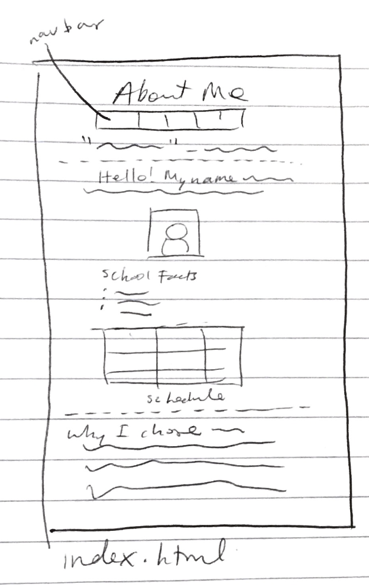
This is the homepage, or the index.html file. It includes school facts.

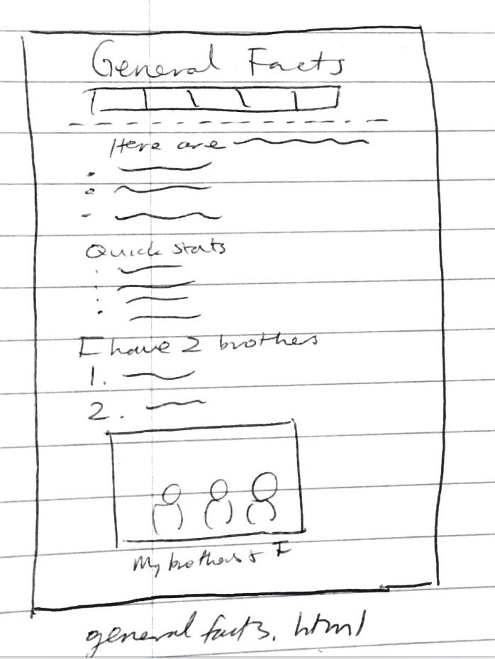
This is the general facts page, or the generalfacts.html file.

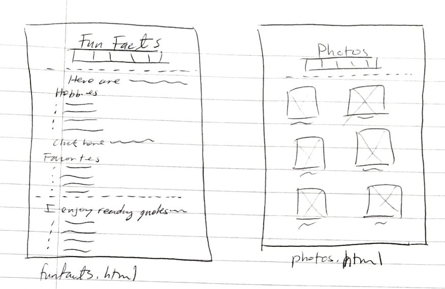
This is the fun facts page, or the funfacts.html file, as well as the page that shows some photos I've taken, or the photos.html file.

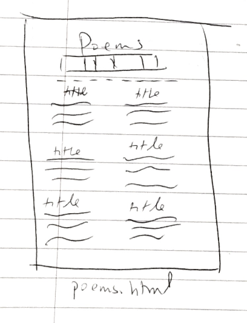
This is the poems page, or the poems.html file. It includes some of the poems I've written.


### Refined Site: Target Audience II (Milestone 1)
> Who is your additional/secondary target audience?

The additional/secondary target audience is people outside of the classes that I'm in and don't know yet, such as: friends of friends, people in clubs I haven't talked to, etc.

### Refined Site: Target Audience II Needs (Milestone 1)
> Document target audience II's needs.
> List each need below. There is no specific number of needs required for this, but you need enough to do the job.

- Need #1: Contact
  - **Need**
    - > What does your target audience II need?

    Currently, I don't have a good way to contact me on this site, and because this secondary audience is people who aren't in my class, they would most likely not have my netid. So, having some form of email, either my cornell email or personal one, would be a good idea.

  - **Design Ideas and Choices**
    - > How will you refine your site's design to meet this need?

    I will include one of my social media links/some way of contact on the homepage, or on the general facts page. This way, people will know the best way to reach me

- Need #2: Organization
  - **Need**
    - > What does your target audience II need?

    Because we are strangers, and would not even be in the same class, target audience II might want a less scattered way to get to know me.
  - **Design Ideas and Choices**
    - > How will you refine your site's design to meet this need?

    I will re-organize the site so that the facts are better grouped. This means doing things like decreasing what's on the homepage, and creating a seperate school facts page, or creating a sidebar with links to some of the pages.

  - Need #3: Outside Hangouts
  - **Need**
    - > What does your target audience II need?

    They might want a way to let me know that we should meet up sometime.
  - **Design Ideas and Choices**
    - > How will you refine your site's design to meet this need?

    I can include a form on one of the pages, or create a new page, that includes a way for us to meet/communicate, if they don't want to reach out via email. I can also include a list of clubs that I am in, so that they would have a better idea of what my schedule is like when I am not attending classes.

### Refined Site: Content Organization/Navigation (Milestone 1)
> Identify the content that is necessary for both target audiences.
> List the content here.
> Don't forget to include the form.

- Organization on the site
- General Facts
- Fun Facts
- School Facts
- Hobbies
- Photos
- Poems
- Contact Information/Email
- Form for a way to contact besides email/for a way we would meet up
- Schedule
- List of clubs

> Organize the content for the target audience and identify possible pages for the content using card sorting.
> First, organize the content for target audience I. Document your card sorting by taking a photo and including it here.

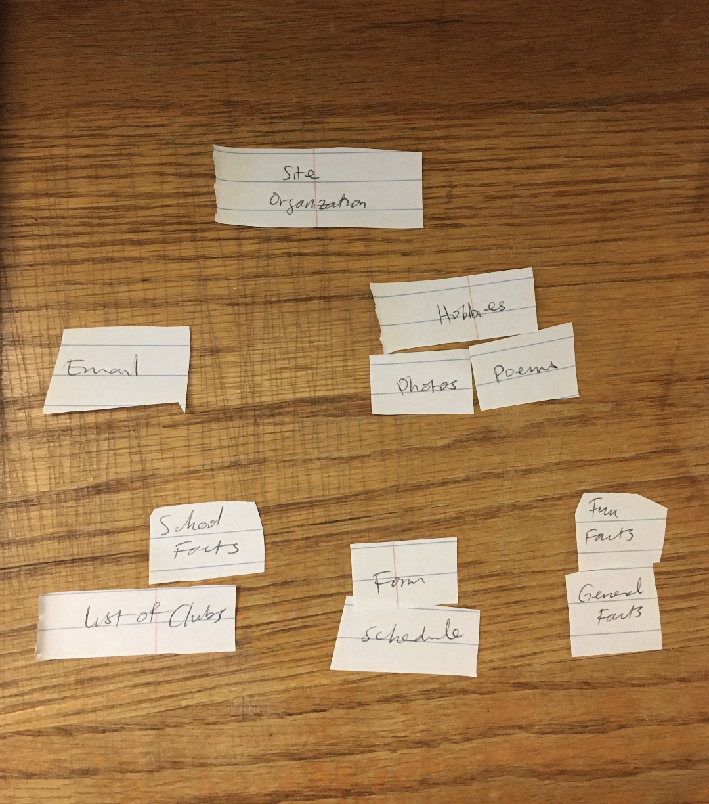

> Second, organize the content for target audience II. Document your card sorting by taking a photo and including it here.

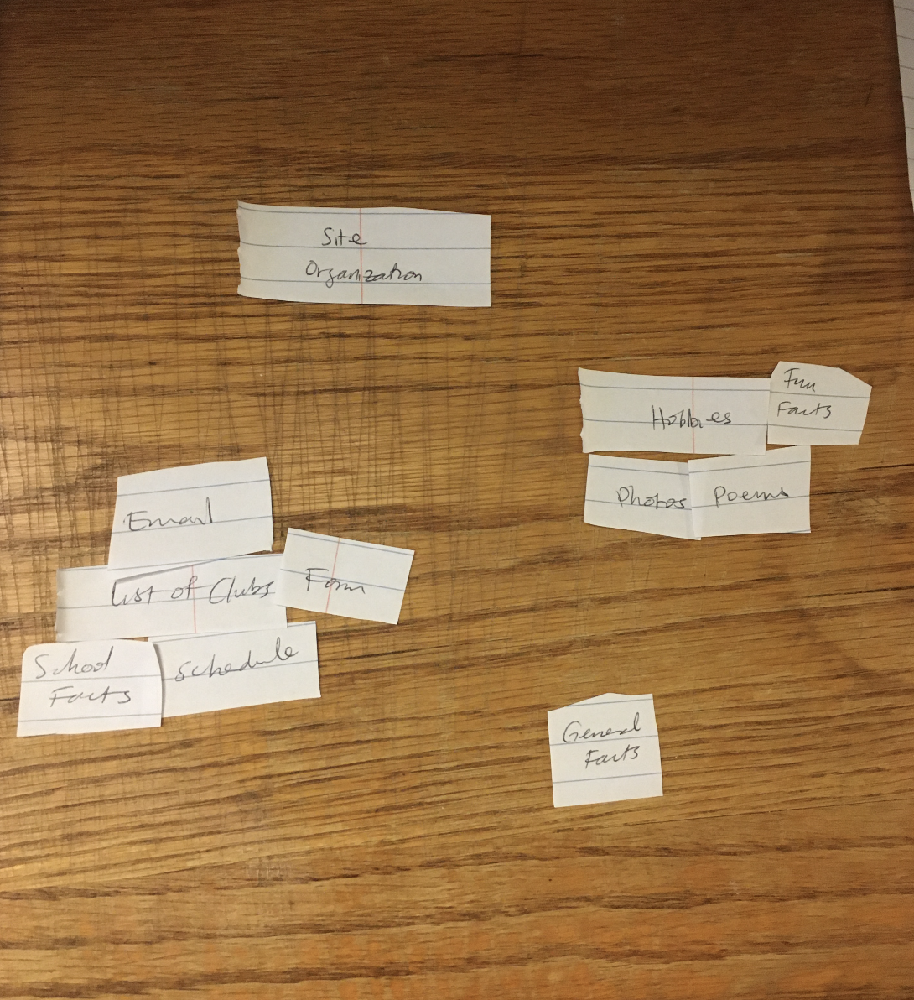

> Next, organize the content for both target audiences. Document your card sorting by taking a photo and including it here.

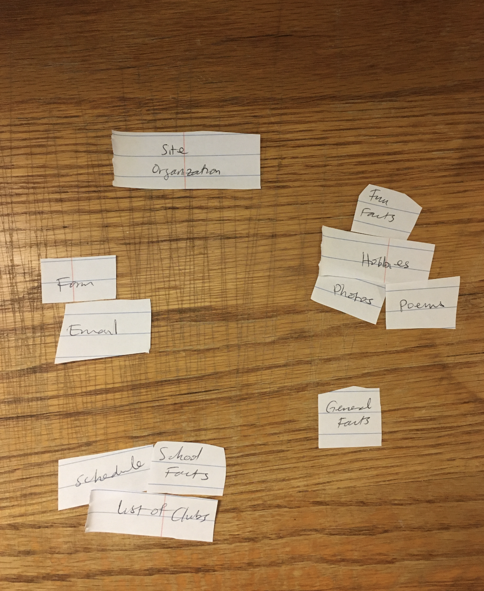

> Lastly, list the pages that resulted from your final card sort (i.e. your site's navigation).

- Homepage with the email and the form
- General Facts page
- School Facts page with my 2020 schedule and a list of clubs
- Fun Facts page that includes my hobbies, and linking to the photos and poems pages


### Refined Site: Design (Milestone 1)
> Refine the design of your site to meet the needs of _both_ target audiences.
> Include sketches of each page of the refined design.
> Provide a brief explanation _underneath_ each sketch.
> Document your _entire_ design process. **Show your preliminary sketches and your final sketches.**
> Don't forget the form and confirmation page!

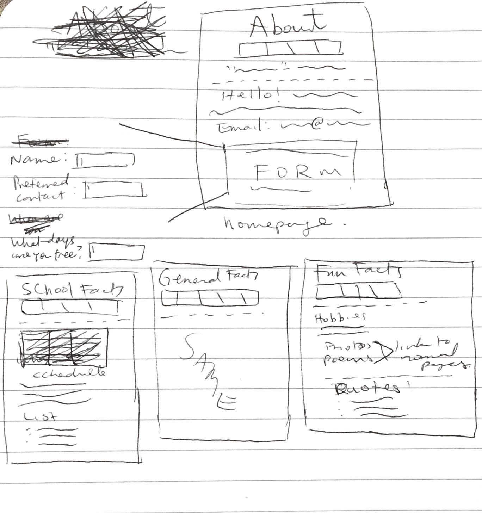
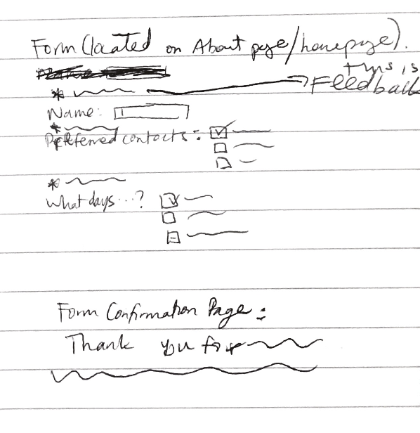
These are the preliminary sketches. The homepage didn't have the form designed into it, and the form was drawn seperately.
The form's design was originally not very effective, because there was a text box to indicate the preferred method of contact, which isn't very useful.

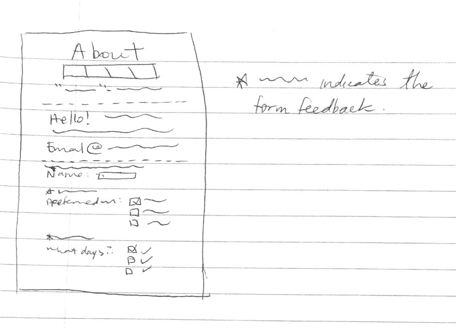
The final sketch of the homepage has the form drawn inside of it. It also includes how the feedback would look.

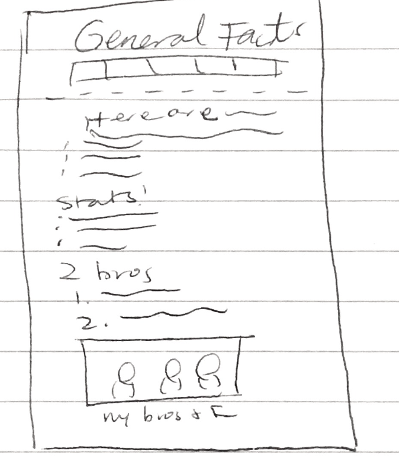
This general facts page will look more or less the same as the original site.

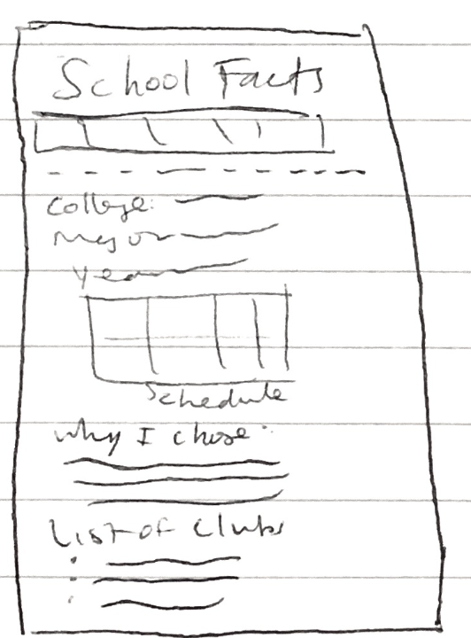
The final sketch of the school facts page includes the more basic things like my majors, but also includes my current Spring 2020 schedule, as well as a list of clubs that I am in.

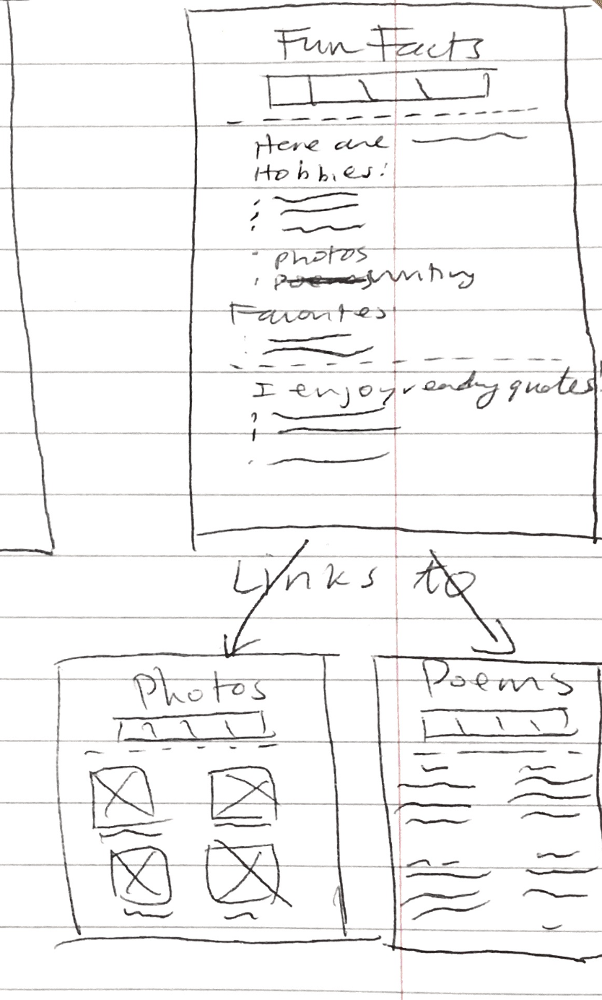
The final sketch of the fun facts includes what was on the original site, but also has links to the photos and the poems page, like the original design.

I think that to make it easier to navigate the site, the photos and poems pages might benefit from not being on the navigation bar.


### Partial Plan (Milestone 1)
> Using your refined sketches, plan your site's partials.
> You may describe each partial or sketch it. It's up to you!

I will include partials to make the navigation bar easier to code and change, if I needed.

I will also use partials to make sure the user knows what the current date is, as opposed to the year that is at the caption of the schedule. This way, the user can know if the website is out of date.

Lastly, I might even use partials to perhaps make it a little bit easier to write out all the "li" open and closing tags, just like in lab01, because I have many lists.


---

## Sticky Form Planning (Milestone 2)

### Sticky Form (Milestone 2)
> What controls do you need for your form?

The controls that are needed are:
checkboxes, for the days and preferred method of contact
text input, for the name
text input, for the netID


> Plan out your feedback messages for your form. You may sketch (probably the easiest) or write it out.

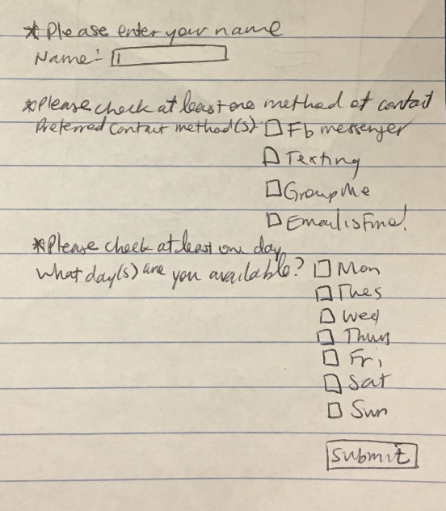


> How does this form meet the needs of at least one of your target audiences (specify which)?

This form meets the needs of both target audiences, because it is a form that users can fill out if they wanted to meet up in person. Because both of my audiences would include people whom I do not know very well, this form will be useful to both of them, in case they would want to meet up instead of just messaging me.


### Validation Code Plan (Milestone 2)
> Write out your pseudocode plan for handling the validation of the form.

```
//default the feedback all to false, so that they don't show up when first loaded
show name feedback = FALSE
show day feedback = FALSE
show contact feedback = FALSE

//have default values for the inputs
name = ''
netid = ''

nameFeedback = ''
.
.
.

if the form was submitted:
  form is valid;

  name = the name that the user inputs
  contact method = the number of checkboxes that have been checked
  day = the number of days that have been checked

  if the order name is empty AND the form has been submitted:
    form is not valid;
    show name feedback

  if the order name is empty AND the form has been submitted:
    form is not valid;
    show name feedback

  if all the checkboxes with the name 'contact' are not checked AND the form has been submitted:
    form is not valid;
    show contact feedback

  if all the checkboxes with the name 'day' are not checked AND the form has been submitted:
    form is not valid;
    show day feedback


show the form when the form is valid

//in the actual html code for the form
if you show the form:
  //sticky form
  replace the value of the input with the corresponding variable above by echoing

  if the feedback variable for the form input is true:
    show the feedback
else:
  show confirmation page, with the values echoed out


```

---

## Complete & Polished Website (Final Submission)

### Target Audiences (Final Submission)
> Tell us how your final site meets the needs of the target audiences. Be specific here. Tell us how you tailored your design, content, etc. to make your website usable by both target audiences.

The final site meets the needs of the target audience by providing a way for anyone who may not know me very well to learn more about who I am. It is seperated into different pages based on the types of facts that would be presented on them, so that people can easily get to that page and not have to read through other facts that they may not want to know. Additionally,the poems and photos are not listed in the navigation bar with the rest of the facts, because the user might click on them expecting a similarly formatted page to the other fact pages. So, I put only linked the photos and the poems page on the Fun Facts page, to lessen any confusion that might arise. There is also a form located on the homepage, which provides a way for the user to provide information if they wanted to meet up outside of just contacting me digitally. The form contains a space for them to put their name, netID, the preferred contact method, and the days that they might be free. This meets the user's needs, because in order for us to meet, I would want to know their name, their netID (so we could have an initial email to start out with), and more specific ways that would make it easier for us to talk and meet.
  At first, the only target audience was people in my classes that I didn't really talk to, so there wasn't really a need for
a form. This was because if we were in the same classes, there was a high chance that we would already know each other's netID's, and that we might have talked at least once. If we had wanted to meet up, we could arrange that in person, when we saw each other in class.  However, with the additional target audience of people outside of class, I may not have even met them in person before, so a form would allow us to meet, especially because we had never spoken before.


### Additional Design Justifications (Final Submission)
> If you feel like you haven’t fully explained your design choices in the final submission, or you want to explain some functions in your site (e.g., if you feel like you make a special design choice which might not meet the final requirement), you can use the additional design justifications to justify your design choices. Remember, this is place for you to justify your design choices which you haven’t covered in the design journey. You don’t need to fill out this section if you think all design choices have been well explained in the design journey.


### Self-Reflection (Final Submission)
> Reflect on what you learned during this assignment. How have you improved from 1300? What things did you have trouble with?

I think that this assignment was very interesting to complete, because I liked that I was able to take the very first project that I made in 1300, and make it into something that seemed more user-friendly and alive. Especially because I used Project 1 from last semester, it was satisfying to be able to make it a lot better, with the additions of PHP. I think that from 1300, I was able to improve the layout, because last semester, I had trouble doing specific page layouts (i.e. Poems page), and ended up just leaving each stanza centered. Now, I could change the stanzas on that page so that they wouldn't be centered. Another thing that I improved upon was thinking about ways that I could use the code to do more specific things. Last semester, I would've had a lot more trouble thinking about how I could make certain aspects easier to code, and this time, with PHP, it was easier to think about how to solve the coding problems I came across. During this project, the checkboxes were hard to code, because it was so different from just using JavaScript and many if-statements. I had to be look for certain functions in PHP that would allow me to accomplish the tasks that I wanted to accomplish, as well as really think about how I could use PHP to my advantage, instead of only using it how it was used in labs or during lectures.
