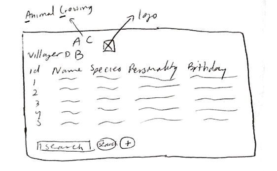
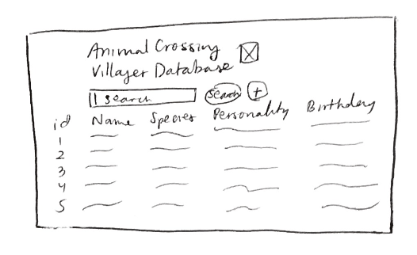
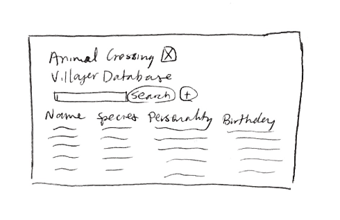
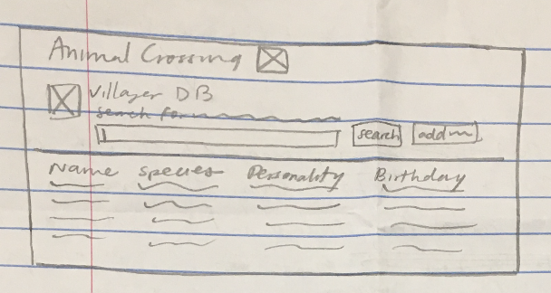
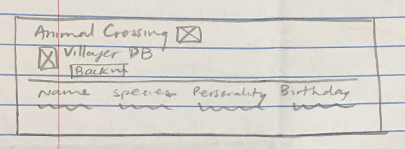
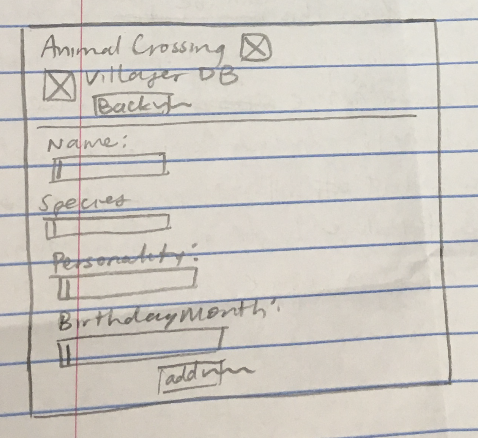
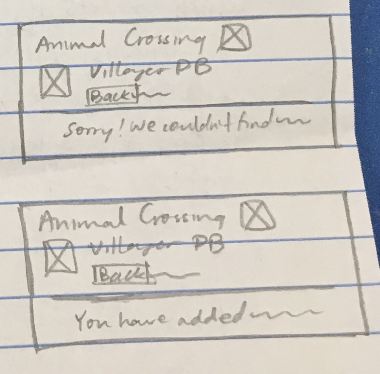

# Project 2: Design Journey

Be clear and concise in your writing. Bullets points are encouraged.

**Everything, including images, must be visible in VS Code's Markdown Preview.** If it's not visible in Markdown Preview, then we won't grade it.

## Catalog (Milestone 1)

### Describe your Catalog (Milestone 1)
> What will your collection be about? What types of attributes will you keep track of for the *things* in your catalog? 1-2 sentences.

My collection will be about the different kinds of villagers in the Animal Crossing video games, vaguely similar to the different types of Pokemon that could be found in a PokeDex catalog. The attributes that I will keep track of will be the villager names, species, personalities, and possibly gender and their first video game appearance.


### Target Audience(s) (Milestone 1)
> Tell us about your target audience(s).

The target audience will be owners of any or all of the Animal Crossing video game, who want to know more about the specific types of villagers that can move into their town. That way, they can know more about how the villagers might act or interact with the users.


### Design Patterns (Milestone 1)
> Review some existing catalog that are similar to yours. List the catalog's you reviewed here. Write a small reflection on how you might use the design patterns you identified in your review in your own catalog.

Similar existing catalog:
-PokeDex (Source: https://pokemondb.net/pokedex/all)

This is similar to the catalog that I would like to create, in that it is more of a visual dictionary, and has specific categories for each pokemon/villager that I would like to include for each one, like a table. I would also like to include a search bar for the users to search for the villagers by each of the field (column) names.


## Design & Planning (Milestone 2)

## Design Process (Milestone 2)
> Document your design process. Show us the evolution of your design from your first idea (sketch) to design you wish to implement (sketch). Show us the process you used to organize content and plan the navigation, if applicable.
> Label all images. All labels must be visible in VS Code's Markdown Preview.
> Clearly label the final design.

This is the first preliminary sketch, where I had the id column, as well as the search bar and insert button at the bottom of the page.




This is the second preliminary sketch. I moved the search bar and insert button to the top because I thought that it would be more easy for users to notice and to use.




This is the third preliminary sketch, and I decided to not include the id column, because that is not how it would be displayed, and in addition, the users wouldn't necessarily have to know the integer values of the id column.




This is the final sketch, and I decided to add an image of one of the villagers next to the words "Villager Database" and the search bar and insert button, so that the page would look more aesthetically pleasing. I also added an hr element that would more clearly divide the table from the search bar, insert button, and the header.




This is the page that will show up after the user has searched for a villager by name, species, personality, or birthday month, and it is in the database.




This is the page of the form, where the user will be able to fill out the required fields (name, personality, and species), and if they want they can fill out the optional birthday month field.




These are the messages that will appear after the user searches for a field value that does not exist, as well as the message that will appear after the user successfully adds a villager to the database.




## Partials (Milestone 2)
> If you have any partials, plan them here.


## Database Schema (Milestone 2)
> Describe the structure of your database. You may use words or a picture. A bulleted list is probably the simplest way to do this. Make sure you include constraints for each field.

Table: villagers
- id: INTEGER {PK, U, Not, AI},
- name: TEXT {U, Not},
- species: TEXT {Not},
- personality: TEXT {Not},
- birthday: TEXT{ }


## Database Query Plan (Milestone 2)
> Plan your database queries. You may use natural language, pseudocode, or SQL.]

1. All records

    ```
    SQL:
    SELECT * FROM villagers;
    ```

2. Search records

    ```
    PHP:
    $search_input = (echo what the user typed)

    SQL:
    SELECT * FROM villagers WHERE ( (name LIKE '%'||:search||'%') || (species LIKE '%'||:search||'%') || (personality LIKE '%'||:search||'%') || (birthday LIKE '%'||:search||'%')  );

    ```

3. Insert record

    ```
    PHP:
    $name_input = (echo what the user typed for the name)
    $species_input = (echo what the user typed for the species)
    $personality_input = (echo what the user typed for the personality)
    $birthday_input = (echo what the user typed for the birthday)

    SQL:
    INSERT INTO villagers (name, species, personality, birthday)
    VALUES ($name_input, $species_input, $personality_input, $birthday_input[this is optional] )

    ```


## Code Planning (Milestone 2)
> Plan any PHP code you'll need here.

```
if the user submitted the form:
    if the inputs were valid:
        make all the feedback hidden
        show the confirmation
    else
        don't show the confirmation
        make the feedback NOT hidden

if the confirmation is TRUE:
    check if the name is already in the database

    if the name is already in the database:
        display a message that says that the name is already in the database
    else
        display a message that says the villager was successfully added


else if confirmation is not TRUE:
    display the form
```

```
function display image:
    echo out all the html needed for the logo image and the additional decorative image at the top left

```


# Reflection (Final Submission)
> Take this time to reflect on what you learned during this assignment. How have you improved since Project 1? What things did you have trouble with?

*Note: one of my user-defined functions is in the init.php file, because I wanted to be able to use it in all my pages, without having to copy paste it twice.*

With this project, I was able to learn how to use SQL and the DB browswer in order to create databases effectively, as well as search through them for specific values. I learned how to write SQL queries to interact with my database. Since project 1, I think that I have improved with my PHP, because I was able to validate the forms easier than I was able to do in both project 1 and the earlier labs. I also was able to understand the echo capability of PHP better, because I didn't have to look back at class notes or past projects/labs as much to help me.
I had trouble with trying to display a message if the user tried to insert a row with a value that was already present,because the constraints I had put on the fields wouldn't allow that to happen, but the page would just be blank. I had been trying many different SQL queries
